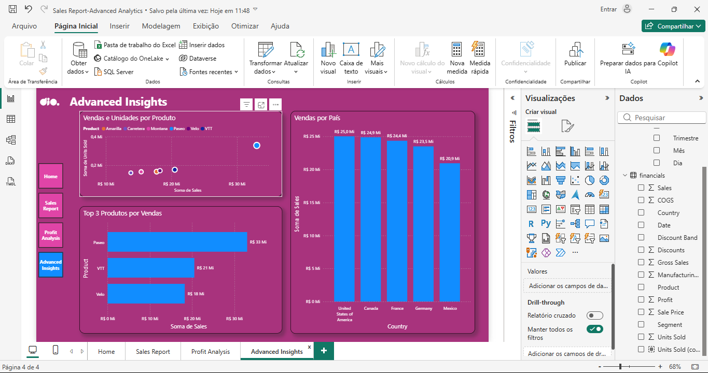

# 📊 Desafio de Projeto: Power BI Advanced Financial Analysis (UX/UI Nativo)

Este repositório contém o projeto de **Análise Financeira Avançada**, focado em performance e usabilidade. O dashboard foi desenvolvido utilizando exclusivamente recursos nativos do Power BI para garantir leveza e uma navegação fluida, superando limitações técnicas de hardware e ambiente.

---

## 🏛️ Contexto e Parcerias

* **Plataforma de Ensino**: [DIO (Digital Innovation One)](https://www.dio.me/)
* **Empresa Patrocinadora**: [Klabin](https://www.klabin.com.br/)
* **Formação**: Power BI Analyst
* **Desenvolvedor**: [Fred Cavalheiro]

---

## 🛠️ Tecnologias Utilizadas

* **[Microsoft Power BI Desktop](https://powerbi.microsoft.com/)**: Desenvolvimento de DAX, ETL e interface visual.
* **Design Nativo e Transparente**: Aplicação de efeitos de borda, contorno e transparência diretamente nos visuais para eliminar camadas desnecessárias.
* **Lógica de Filtros Top N**: Implementação de rankings automáticos para identificação de produtos líderes.

---

## ⚠️ Justificativa Técnica e Adaptações de Ambiente

Este projeto é uma prova de **resiliência técnica** e foco em **eficiência de fluxo**:

* **Otimização contra Pop-ups e Travamentos**: Identifiquei que o uso de múltiplas formas e elementos de design sobrepostos gerava "pop-ups" de seleção a cada clique. Em um ambiente com 10 elementos, eram necessários 10 cliques para limpar a visão, o que atrasava o desenvolvimento e prejudicava a experiência do usuário. Optei por um design limpo, aplicando a estética diretamente nos gráficos, eliminando interrupções.
* **Hardware e Estabilidade**: Devido ao uso de uma máquina emprestada com recursos limitados, priorizei um arquivo leve. Evitei imagens de fundo pesadas, garantindo que o Power BI não congelasse durante a manipulação dos dados.
* **Foco em Insights Reais**: Substituí botões complexos (que exigem conta corporativa para publicação plena) por uma navegação direta e visuais de alta leitura, como a Matriz de Dados e Gráficos de Dispersão para identificação de Outliers.

---

## 📂 Entregáveis do Projeto (Arquivos e Evidências)

Abaixo, os links para o projeto e as capturas de tela. 

* [📥 **Baixar Arquivo Power BI (.pbix)**](./PowerBI-Financial-Advanced-Analysips.pbix)  
  > *Nota: É necessário ter o Microsoft Power BI Desktop instalado para visualizar o arquivo localmente.*

### 🖼️ Galeria de Telas (Clique para ampliar)
1. [**Ver Capa (Home)**](./01_Home_Dashboard.png)
2. [**Ver Sales Report (Pág. 1)**](./02_Sales_Report.png)
3. [**Ver Profit Analysis (Pág. 2)**](./03_Profit_Analysis.png)
4. [**Ver Advanced Insights (Pág. 3)**](./04_Advanced_Insights.png)

---

## 🚀 Estrutura do Relatório

1. **Home**: Interface de entrada com navegação simplificada.
2. **Sales Report**: Visão geral de vendas por segmento e produtos.
3. **Profit Analysis**: Análise de lucratividade com matriz detalhada por trimestre/ano.
4. **Advanced Insights**: Análise de dispersão para identificar outliers e **Top 3 Produtos** por vendas.

---

## ⚙️ Visualização das Páginas

1. **Página 01 - Home & Sales:** 

2. **Página 02 - Profit Analysis:** 

3. **Página 03 - Advanced Insights (Top N):** 

---

## 📞 Contato e Conexão
**Fred Cavalheiro**
* 🔄 **Transição de Carreira:** De Segurança Patrimonial (Vigilante) para Tecnologia/Dados.
* 🎓 **Técnico em Desenvolvimento de Sistemas** (Senac).
* 📚 **Estudante de:** Machine Learning e Análise de Dados (Python, Neo4j, Power BI e Excel).
* 🔗 **[Meu Perfil no LinkedIn](https://www.linkedin.com/in/fred-cavalheiro/)**

---
**Projeto desenvolvido para demonstrar superação de barreiras técnicas e competência em entrega de resultados analíticos com Power BI.**
